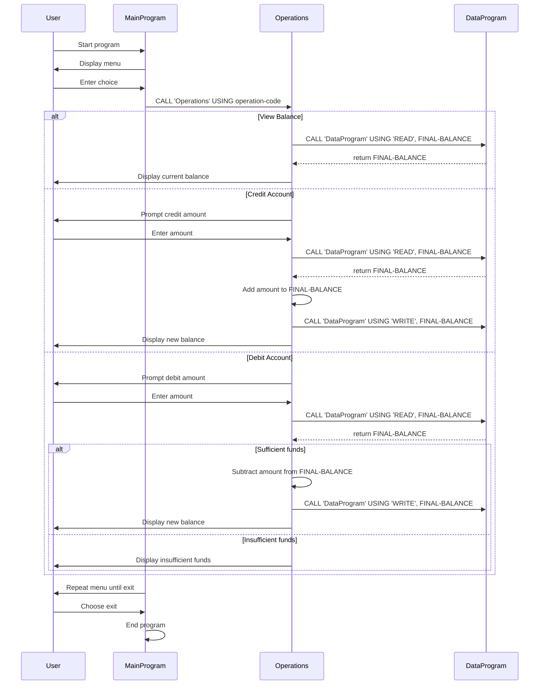

# COBOL Account Management Documentation

This documentation explains the purpose of each COBOL source file in `src/cobol/`, the key program behavior, and the main account business rules.

## Overview

The COBOL program implements a simple account management system with menu-driven operations for viewing the balance, crediting the account, and debiting the account.

## File purpose

### `src/cobol/main.cob`
- Entry point for the application.
- Displays a menu with options:
  - View Balance
  - Credit Account
  - Debit Account
  - Exit
- Reads the user's choice and calls `Operations` with the selected operation.
- Uses a loop to continue until the user chooses to exit.

### `src/cobol/operations.cob`
- Handles the account operation requested by `MainProgram`.
- Receives an operation code via linkage:
  - `'TOTAL '` for view balance
  - `'CREDIT'` for crediting funds
  - `'DEBIT '` for debiting funds
- For each operation:
  - `'TOTAL '` calls `DataProgram` with `READ` and displays the current balance.
  - `'CREDIT'` prompts for an amount, reads the current balance, adds the amount, writes the new balance, and displays the result.
  - `'DEBIT '` prompts for an amount, reads the current balance, checks if funds are sufficient, subtracts the amount if allowed, writes the new balance, and displays the result.

### `src/cobol/data.cob`
- Acts as the simple data storage program.
- Maintains `STORAGE-BALANCE` in working storage with initial value `1000.00`.
- Supports two operations via linkage:
  - `READ` copies the stored balance to the caller.
  - `WRITE` updates the stored balance with the caller-provided value.
- Provides a centralized place for account balance storage and persistence within the running program.

## Key business rules

- The account starts with an initial balance of `1000.00`.
- Credit operations always add the entered amount to the current balance.
- Debit operations only proceed if the current balance is greater than or equal to the requested debit amount.
- If a debit request exceeds the available balance, the system displays an "Insufficient funds" message and does not change the stored balance.
- The balance is always read from `DataProgram` before modifying it and written back only after successful credit or debit operations.
- The program treats the balance as a numeric value with two decimal places.

## Notes

- The COBOL program uses CALL linkage to separate concerns across `MainProgram`, `Operations`, and `DataProgram`.
- There is no external file storage in this version; the balance exists only while the program runs.
- The menu interface is text-based and expects numeric input for menu choices and amounts.

## Sequence Diagram

